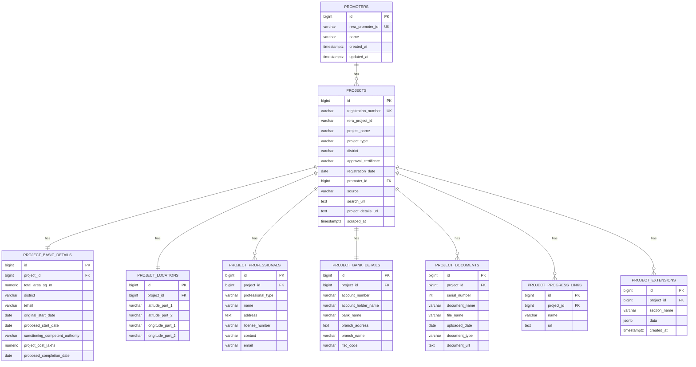

# UP-RERA ER Diagram

Paste this Mermaid diagram into a Mermaid-compatible Markdown viewer.

```mermaid
erDiagram
    PROMOTERS ||--o{ PROJECTS : has

    PROJECTS ||--|| PROJECT_BASIC_DETAILS : has
    PROJECTS ||--|| PROJECT_LOCATIONS : has
    PROJECTS ||--o{ PROJECT_PROFESSIONALS : has
    PROJECTS ||--|| PROJECT_BANK_DETAILS : has
    PROJECTS ||--o{ PROJECT_DOCUMENTS : has
    PROJECTS ||--o{ PROJECT_PROGRESS_LINKS : has
    PROJECTS ||--o{ PROJECT_EXTENSIONS : has

    PROMOTERS {
        bigint id PK
        varchar rera_promoter_id UK
        varchar name
        timestamptz created_at
        timestamptz updated_at
    }

    PROJECTS {
        bigint id PK
        varchar registration_number UK
        varchar rera_project_id
        varchar project_name
        varchar project_type
        varchar district
        varchar approval_certificate
        date registration_date
        bigint promoter_id FK
        varchar source
        text search_url
        text project_details_url
        timestamptz scraped_at
    }

    PROJECT_BASIC_DETAILS {
        bigint id PK
        bigint project_id FK
        numeric total_area_sq_m
        varchar district
        varchar tehsil
        date original_start_date
        date proposed_start_date
        varchar sanctioning_competent_authority
        numeric project_cost_lakhs
        date proposed_completion_date
    }

    PROJECT_LOCATIONS {
        bigint id PK
        bigint project_id FK
        varchar latitude_part_1
        varchar latitude_part_2
        varchar longitude_part_1
        varchar longitude_part_2
    }

    PROJECT_PROFESSIONALS {
        bigint id PK
        bigint project_id FK
        varchar professional_type
        varchar name
        text address
        varchar license_number
        varchar contact
        varchar email
    }

    PROJECT_BANK_DETAILS {
        bigint id PK
        bigint project_id FK
        varchar account_number
        varchar account_holder_name
        varchar bank_name
        text branch_address
        varchar branch_name
        varchar ifsc_code
    }

    PROJECT_DOCUMENTS {
        bigint id PK
        bigint project_id FK
        int serial_number
        varchar document_name
        varchar file_name
        date uploaded_date
        varchar document_type
        text document_url
    }

    PROJECT_PROGRESS_LINKS {
        bigint id PK
        bigint project_id FK
        varchar name
        text url
    }

    PROJECT_EXTENSIONS {
        bigint id PK
        bigint project_id FK
        varchar section_name
        jsonb data
        timestamptz created_at
    }
```
